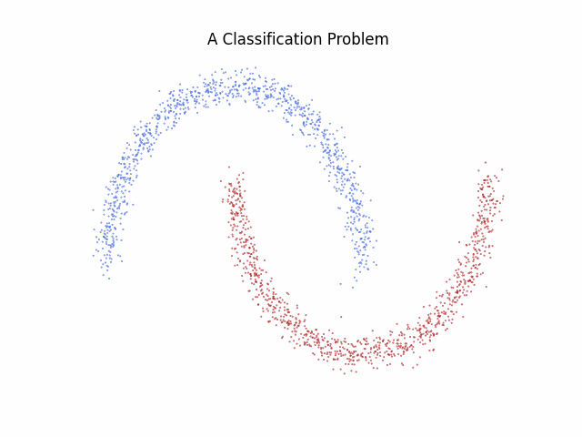
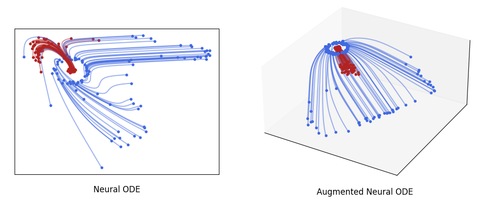
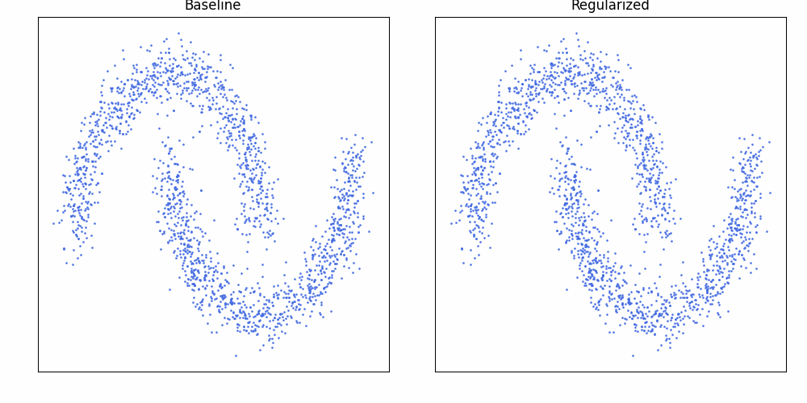

# Neural ODEs

Neural ODEs leverage Ordinary Differential Equations to develop new deep learning architectures. These architectures learn dynamics of the form:

$
\frac{dX(t)}{dt} = f_\theta(X(t), t), \quad X(0) = x,
$

where $f_\theta$ is a neural network, and $x \in \mathbb{R}^n$ represents some data. The final prediction is then taken to be $X(1)$.

  

    

    
      

  

Originally proposed by [Chen et al., 2018](https://arxiv.org/abs/1806.07366), Neural ODEs have gained significant attention, and there is now an increasing availability of software tools that facilitate their implementation. In this repository, we will explore various methods to improve the learning capabilities of Neural ODEs. We will use the [TorchDyn](https://physical-reasoning.github.io/assets/pdf/papers/03.pdf), which is a library built upon PyTorch, providing a comprehensive set of tools for working with Neural ODEs.

## Augmentation

Traditional neural ODEs struggle to learn certain functions. However, **augmentation techniques** can learn arbitrary functions. For further exploration, see [Augmentation.ipynb](./Augmentation.ipynb) and the [original paper](https://arxiv.org/abs/1904.01681).

  

        

          
        

  

## Physical Priors

Neural ODEs offer a natural way to incorporate physical priors, such as energy conservation, into deep learning models. One prominent example of this is **Hamiltonian Neural Networks** ([original paper](https://arxiv.org/pdf/1906.01563)). See the notebook [hnn.ipynb](./hnn.ipynb).

  

        

    
        

  

## Continuous Normalizing Flows

Neural ODEs can also be used for flow-based approaches to generating distributions, known as **Continuous Normalizing Flows (CNFs)** ([original paper](https://arxiv.org/abs/1806.07366)). Additionally, they offer a natural framework to introduce Optimal Transport-inspired regularizers to improve convergence rates ([see also](https://cfinlay.github.io/files/publications/TrainNeuralODE.pdf)). This can be explored in [cnfs.ipynb](./cnfs.ipynb)

  

        

    
        

  

