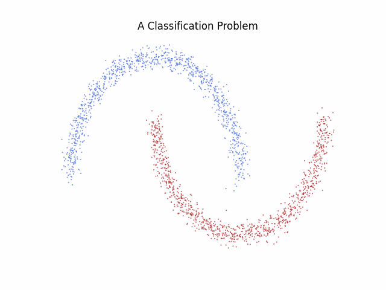

# Neural ODEs

Neural ODEs leverage Ordinary Differential Equations to develop new deep learning architectures. These architectures learn dynamics of the form:

$$
\frac{dX(t)}{dt} = f_\theta(X(t), t), \quad X(0) = x,
$$

where $ f_\theta $ is a neural network, and $ x \in \mathbb{R}^n $ represents some data. The final prediction is then taken to be $ X(1) $.

  

    
  

Originally proposed by **Chen et al.**, Neural ODEs have gained significant attention, and there is now an increasing availability of software tools for easy implementation. In this tutorial, we will explore **Torchdyn** (cite), a library offering a variety of tools to implement neural ODEs.

## Augmentation

Traditional neural ODEs struggle to learn certain functions. However, **augmentation techniques** can learn arbitrary functions. For further exploration, see [Augmentation.ipynb](./Augmentation.ipynb).

## Physical Priors

Neural ODEs offer a natural way to incorporate physical priors, such as energy conservation, into deep learning models. One prominant example of this is **Hamiltonian Neural Networks**. See the notebook [hnn.ipynb](./hnn.ipynb).

## Continuous Normalizing Flows

Neural ODEs can also be used for flow-based approaches to generating distributions, known as **Continuous Normalizing Flows (CNFs)**. Additionally, they offer a natural framework to introduce Optimal Transport-inspired regularizers to improve convergence rates. This can be exmplored in [cnfs.ipynb](./cnfs.ipynb)
